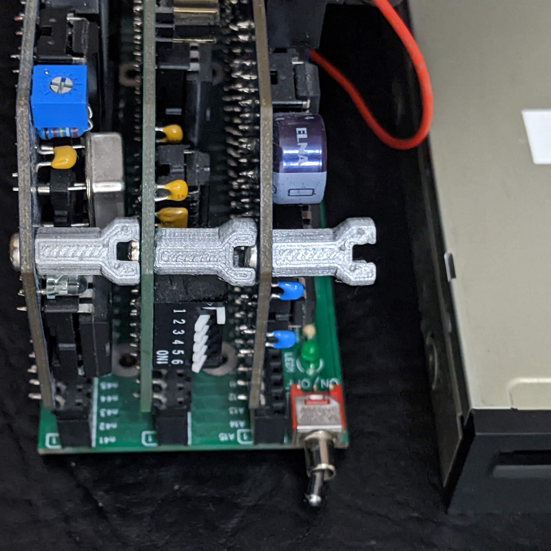
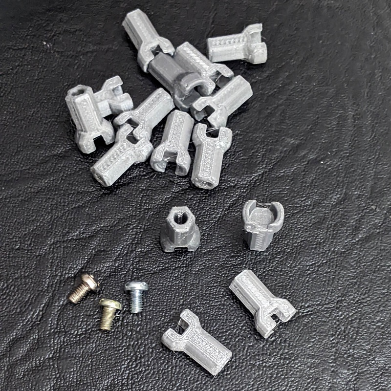

# rcbus-spacer
3D Printed Spacer for RCBus Modules

## Description

This 3D printed spacer is intended be used in RCBus systems to ensure the correct spacing between modules and to prevent modules falling one on another, potentially causing a short-circut between modules.

The spacer is designed to be secured with M3 screw. The spacer has an indent for the head of the screw of the next module. Pan head or socket cup head M3 x 6mm screws are recommended.

The spacer can be printed using solid filament (PETG, PLA, ABS, Nylon). It is recommended to use high quality, 0.1 mm layer thickness with 100% fill.

## Files

* STL file: [RCBus_Spacer.stl](https://github.com/skiselev/rcbus-spacer/blob/main/printed/RCBus_Spacer.stl)
* OpenSCAD source code: [RCBus_Spacer.scad](https://github.com/skiselev/rcbus-spacer/blob/main/printed/RCBus_Spacer.scad)

## Images

